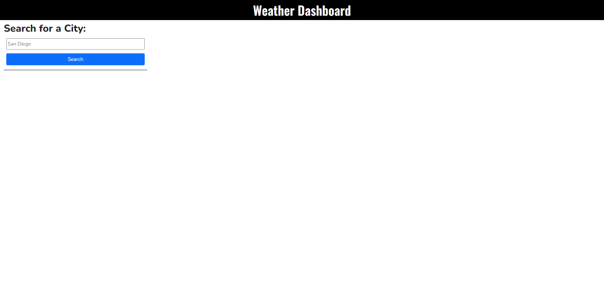
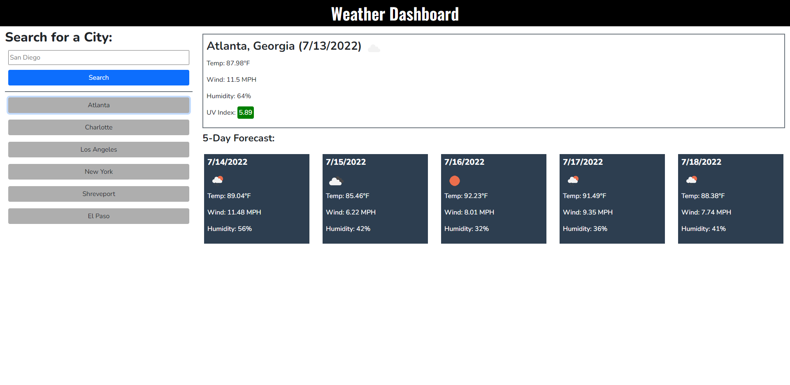

# 05 Third-Party APIs: Work Day Scheduler

## Instructions

The user may enter a city name into the provided input box. Once the search button is clicked, weather information about the provided city will display
Once cities have been searched, they will be logged and a button for the respective city will be displayed for easy access to that data

## Appearance

The starting interface is very simple. The only fields available to the user are the input box and the search button. Once a city has been requested, information will populate the page with current weather information about the requested city. This includes the temperature, wind speed, humidity and UV index. Below the current information is a 5-day forecast that predicts the weather for the next 5 days in the requested city. Once a city has been searched, it will populate underneath of the search bar. This is for easy return to previously searched cities.

## Interface

## Github Pages

https://alkarias.github.io/charles_morton_weather_dashboard/